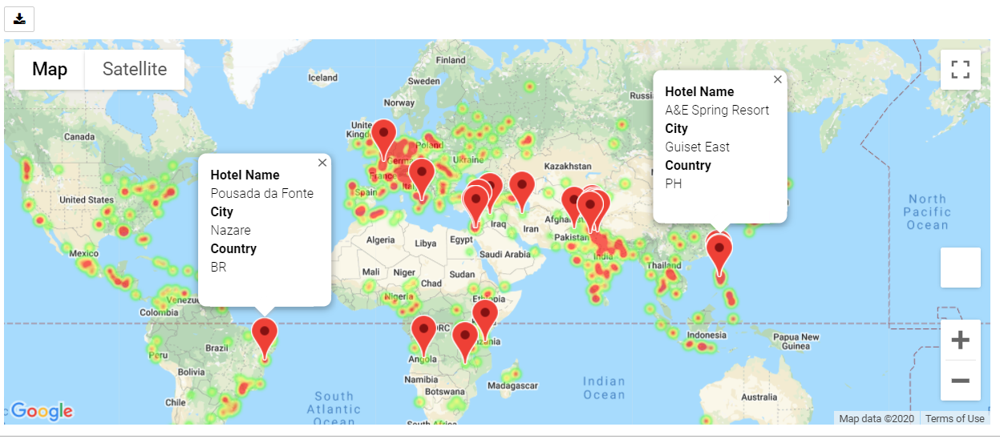

# python-api-challenge, beenhakker

## Part One

### A few general considerations

<li> I did not find citipy very helpful. That is, the vast majority of cities I found based on a random set of latitude/longitude coordinates could not be found on <em>OpenWeather</em>. At one point, I generated a list of 25,000 cities, and <em>OpenWeather</em> only found ~150 cities. As this step was the bottleneck in my homework, I attemped an alternative approach to generate a list of 500 random cities (see below).
</li>
<li> To generate a list of 500 random cities accessible by <em>OpenWeather</em>, I decided to download their json file (<a href="https://bulk.openweathermap.org/sample/">link</a>) that contains a list of all currently available cities. I then created a pandas dataframe from that json file. Finally, I used the <strong>sample</strong> function to randomly sample 500 rows of the dataframe. 
</li>

### What the data are telling me
<li> I created a python function that received parameter-specific plotting data, and I then used the same function for all required plots. Therefore, even though plotting weather parameters against all <em>combined</em> northern and southern latitudes (and calculating the regression/Pearsons R) doesn't make much sense, I thought it might be interesting nonetheless.
</li>
<li> When considering the data based on <em>either</em> norther <em>or</em> southern hemisphere data, then the most striking (and expected) correlation is between latitude and temperature. Not suprisingly, the latitude versus temperature correlation was negative when looking at the northern hemisphere and positive when looking at ther southern hemisphere. Latitude correlations with other weather parameters were less striking (but northern latitudes versus cloudiness appeared correlated).</li>
<li> A word of caution: my data set (i.e. the randomly chosen 500 cities) was skewed towards cities in the norther hemisphere. In the future, I may want to consider first splitting up the entire city data set supplied by <em>OpenWeather</em> by hemisphere, and then randomly selecting 250 cities from both hemispheres. Or, better yet, selecting an equal number of cities in each range of latitudes (e.g. every 10 degrees).
    
 
 
    
## Part Two
### A few general considerations
<li> This was surprisingly not too painful. I'm surpised how easy the <em>gmaps</em> map maker is to implement.</li>
<li> I got a bit tripped up when first using the googleapi because I was looking for "hotels". I then looked on their website and found all searchable keywords (<a href="https://developers.google.com/places/web-service/supported_types" >searchable keywords</a>). I then realized that I should search for "lodging" instead. For what it's worth, "hotels" returned banks and toilets.</li>
<li> I didn't quite understand how the supplied code was adding labels to the map markers. This video helped: <a href="https://www.youtube.com/watch?v=8wsAmivFTww">map tags</a>.</li>
<li> Here's my final heatmap:</li>

    
    

